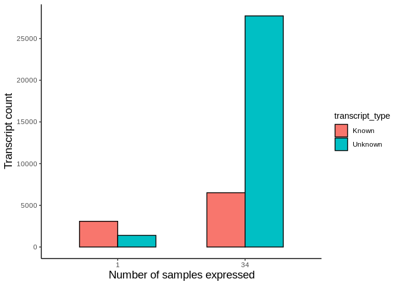
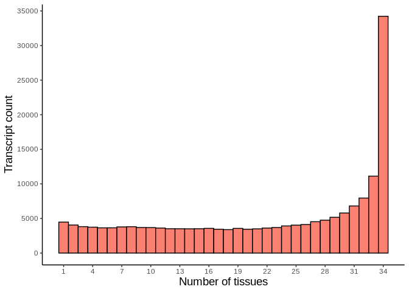
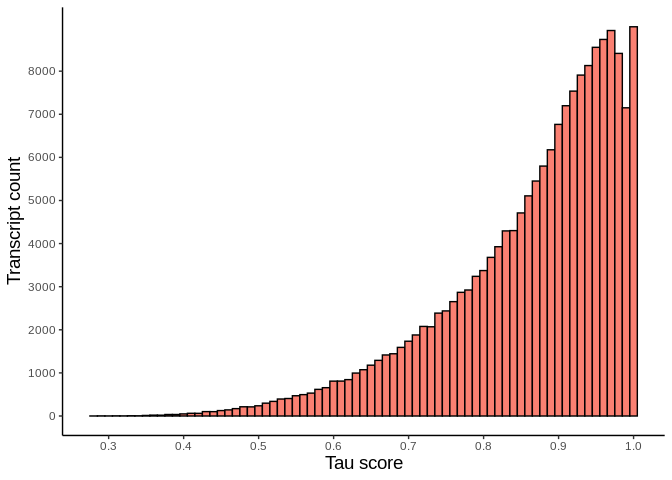

A simple description of Salmon output (https://combine-lab.github.io/salmon/) for transcript expression in 34 tissues samples from 2 horses (Equus ferus caballus, no data available on breed type)

Presented code uses file generated by sf_upload.R


```r
library(tidyverse)
```

```
## ── Attaching packages ──────────────────────────────────────────────────────────────────────────────────────────────────────────── tidyverse 1.3.0 ──
```

```
## ✓ ggplot2 3.3.2     ✓ purrr   0.3.4
## ✓ tibble  3.0.3     ✓ dplyr   1.0.0
## ✓ tidyr   1.1.0     ✓ stringr 1.4.0
## ✓ readr   1.3.1     ✓ forcats 0.5.0
```

```
## ── Conflicts ─────────────────────────────────────────────────────────────────────────────────────────────────────────────── tidyverse_conflicts() ──
## x dplyr::filter() masks stats::filter()
## x dplyr::lag()    masks stats::lag()
```

### Loading dataset

```r
df_orig <- readRDS('sfbind') 
```

### Seperating animal id from tissue name

```r
df <- df_orig %>% separate(tissue, into = c('animal','tissue'),sep='_')
```

```
## Warning: Expected 2 pieces. Additional pieces discarded in 20873058 rows [1, 2,
## 3, 4, 5, 6, 7, 8, 9, 10, 11, 12, 13, 14, 15, 16, 17, 18, 19, 20, ...].
```
### Seperating transcripts into variants recorded in Ensembl and unknown


```r
df$transcript_type <- ifelse(grepl('^EN',df$Name),'Known','Unknown')

### Removing variants with Transcript Per Million (TPM) count = 0
id.map <- df %>% filter(TPM > 0) %>% select(Name,transcript_type)
head(df)
```

```
##        Name Length EffectiveLength      TPM NumReads animal  tissue
## 1 MSTRG.1.3   2147        2017.222 1.394077 52.71684 683610 Adipose
## 2 MSTRG.1.2   1965        1713.419 0.000000  0.00000 683610 Adipose
## 3 MSTRG.1.1   2207        1934.366 1.974033 71.58169 683610 Adipose
## 4 MSTRG.1.4   2121        1840.515 0.678650 23.41500 683610 Adipose
## 5 MSTRG.1.5   2194        1945.727 1.316655 48.02450 683610 Adipose
## 6 MSTRG.1.7   1486        1280.909 0.000000  0.00000 683610 Adipose
##   transcript_type
## 1         Unknown
## 2         Unknown
## 3         Unknown
## 4         Unknown
## 5         Unknown
## 6         Unknown
```

### Calculating ratio of known and unknown transcripts

```r
map_count <- df %>% group_by(transcript_type) %>% summarise(n = n())
```

```
## `summarise()` ungrouping output (override with `.groups` argument)
```

```r
map_count[1,3] <- round(map_count[1,2]/nrow(df),2)
map_count[2,3] <- round(map_count[2,2]/nrow(df),2)
colnames(map_count) <- c('transcript_type','n','ratio')
map_count
```

```
## # A tibble: 2 x 3
##   transcript_type        n ratio
##   <chr>              <int> <dbl>
## 1 Known            6397794  0.31
## 2 Unknown         14475264  0.69
```

### Loading tau score


```r
tau <- read.table('tau_v2.txt')
colnames(tau) <- c('Name','tau')
tau <- tau %>% inner_join(id.map,by = 'Name') %>% distinct()

tau_mRNA_summary <- tau %>% summarise(mean_tau = mean(tau), sd_tau = sd(tau), median_tau = median(tau))
tau_mRNA_summary
```

```
##    mean_tau    sd_tau median_tau
## 1 0.8643569 0.1151367      0.895
```

### Checking number of samples in which specific transcript is detected

```r
n_exp <- read.table('number_of_samples_expressed_v2.txt') 
colnames(n_exp) <- c('Name','number_of_samples_expressed')
n_exp <- n_exp %>% inner_join(id.map,by = 'Name') %>% distinct()
head(n_exp)
```

```
##                 Name number_of_samples_expressed transcript_type
## 1 ENSECAT00000027895                          10           Known
## 2 ENSECAT00000027892                           3           Known
## 3 ENSECAT00000027899                          10           Known
## 4      MSTRG.28760.2                          30         Unknown
## 5     MSTRG.51096.13                          21         Unknown
## 6 ENSECAT00000034067                          26           Known
```

### Counting sample specific and widely-expressed transcripts

```r
topbot <- n_exp %>% filter(number_of_samples_expressed == 1 | number_of_samples_expressed == 34)

topbot %>% ggplot(aes(as.factor(number_of_samples_expressed), fill=transcript_type)) + geom_bar(col='black',position = 'dodge',width = 0.6) + theme_classic() + ylab('Transcript count') + xlab('Number of samples expressed') + theme(axis.title = element_text( size = 14 )) + scale_y_continuous(breaks = seq(0,40000,5000))
```

<!-- -->

```r
topbotsum <- topbot %>% group_by(transcript_type,number_of_samples_expressed) %>% summarise(n=n())
```

```
## `summarise()` regrouping output by 'transcript_type' (override with `.groups` argument)
```

```r
topbotsum
```

```
## # A tibble: 4 x 3
## # Groups:   transcript_type [2]
##   transcript_type number_of_samples_expressed     n
##   <chr>                                 <int> <int>
## 1 Known                                     1  3082
## 2 Known                                    34  6510
## 3 Unknown                                   1  1395
## 4 Unknown                                  34 27719
```

### Checking sample-specific transcripts (tau > 99%) and widely-expressed (tau < 50%)

```r
df_filtered <- df %>% filter(TPM > 0) %>% select(-transcript_type)

df_sample <- df_filtered %>% inner_join(tau)
```

```
## Joining, by = "Name"
```

```r
sample_tau <- df_sample %>% filter(tau >= 0.99 | tau <= 0.5) %>% group_by(transcript_type) %>% summarise('tau >99%'=sum(tau>0.99), 'tau <50%' = sum(tau<0.5))
```

```
## `summarise()` ungrouping output (override with `.groups` argument)
```

```r
sample_tau
```

```
## # A tibble: 2 x 3
##   transcript_type `tau >99%` `tau <50%`
##   <chr>                <int>      <int>
## 1 Known                35155      53199
## 2 Unknown              81357     114819
```


```r
n_exp %>% ggplot(aes(number_of_samples_expressed)) + geom_histogram(col='black',fill='salmon',binwidth = 1) + theme_classic() + ylab('Transcript count') + xlab('Number of tissues')  + scale_x_continuous(breaks = seq(1,34,3)) + theme(strip.text = element_text(size = 15), axis.title = element_text( size = 14 )) + scale_y_continuous(breaks = seq(0,40000,5000)) 
```

<!-- -->


```r
tau %>% ggplot(aes(tau)) + geom_histogram(col='black',fill='salmon', binwidth = 0.01) + theme_classic() + ylab('Transcript count') + xlab('Tau score')  + scale_x_continuous(breaks = seq(0.2,1,0.1))  + theme(strip.text = element_text(size = 15), axis.title = element_text( size = 14 )) + scale_y_continuous(breaks = seq(0,8000,1000))
```

<!-- -->

